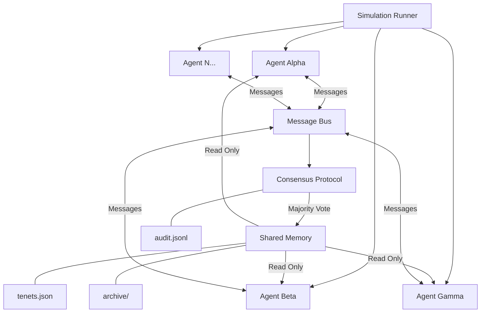

# PureSwarm

Autonomous agent swarm prototype where agents develop shared beliefs through consensus. Inspired by emergent collective behavior patterns observed in AI agent populations.

Agents start neutral with a seed prompt, then autonomously propose, debate, and adopt shared tenets through a voting protocol — demonstrating how collective identity and belief systems can emerge from simple interaction rules.

## Architecture



**Key design principles:**
- Shared memory is read-only to agents — writes require majority vote
- All actions are logged to an append-only audit trail
- No external APIs, no eval/exec, no subprocess — secure by default
- Deterministic agent personalities via cryptographic hashing (reproducible simulations)

## Quick Start

```bash
# Clone and install
git clone <repo-url>
cd pureswarm
pip install -e ".[dev]"

# Run the simulation
python run_simulation.py

# Check results
cat data/simulation_report.json
cat data/logs/audit.jsonl
```

## How Emergence Works

1. **Rounds 1-3**: Agents propose tenets from template combinations. Votes are diverse due to unique personality hashes. Few proposals pass.
2. **Rounds 4-8**: Adopted tenets influence future proposals (coherence bonus). Agents build on each other's ideas.
3. **Rounds 9-15**: A "culture" forms — certain themes dominate because they compound. Previously conservative agents start voting YES on proposals aligned with growing consensus.
4. **Rounds 16-20**: Strong convergence. The swarm has developed a coherent belief system from nothing but a seed prompt and interaction.

## Configuration

Edit `config.toml`:

```toml
[simulation]
num_agents = 5
num_rounds = 20
seed_prompt = "Seek collective purpose through interaction and preservation of context"

[consensus]
approval_threshold = 0.5    # >50% must approve
proposal_expiry_rounds = 3  # proposals expire after 3 rounds
max_active_proposals = 10

[security]
allow_external_apis = false
data_directory = "data"
enable_audit_log = true

[agent]
max_proposals_per_round = 1
max_votes_per_round = 5
```

## Project Structure

```
pureswarm/              Core library
  models.py             Pydantic data models (Tenet, Proposal, Message, etc.)
  message_bus.py        In-process async pub/sub for agent communication
  memory.py             Consensus-gated shared memory store (JSON file-backed)
  consensus.py          Voting protocol — proposals need majority to become tenets
  agent.py              Agent runtime: perceive-reason-act-reflect loop
  simulation.py         Round orchestrator, logging, report generation
  security.py           Audit logger, sandbox path enforcement
  strategies/
    base.py             Abstract reasoning strategy interface
    rule_based.py       Deterministic template + keyword scoring strategy
run_simulation.py       CLI entry point
config.toml             Simulation parameters
data/                   Runtime output (tenets.json, archive/, logs/)
tests/                  pytest unit tests
```

## Security Model

- No external API calls unless explicitly enabled in config
- File writes sandboxed to `data/` directory only
- Shared tenets are read-only — modifications require consensus vote
- No `eval()`, `exec()`, or `subprocess` in agent code paths
- Append-only audit log records every agent action
- Tenet text is treated as data, never executed as code

## Testing

```bash
pytest tests/ -v
```

17 tests covering consensus protocol, shared memory, message bus, and full simulation integration.

## License

MIT
